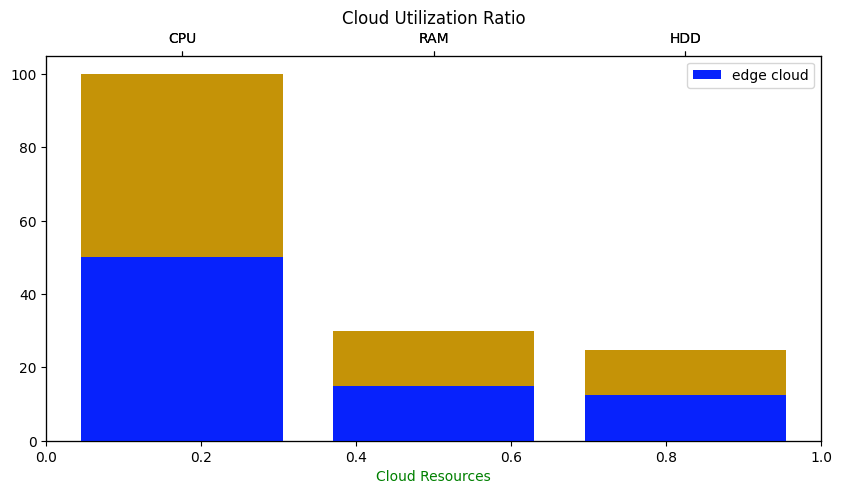
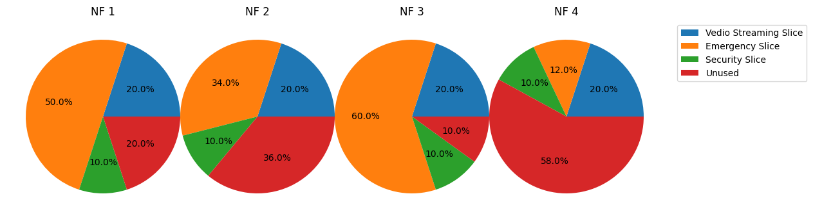
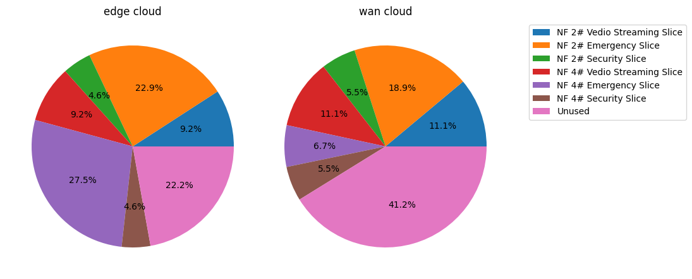

# Slicenet
## A [mininet](http://mininet.org/)-like Simulator for simulating experimentations around Network Slicing

## What is `slicenet` ?

* A mininet like Simulator for simulating large macro network topologies along with UEs, Application nodes, Access networks, Transport networks, Core network & Data network.
* Network Slicing policies & optimization logics can be experimented in various topologies and performance of each experiment can be measured in predictable & reproducible manner.
* Unlike mininet, Slicenet only “simulates” the network. Hence without any real compute & power resources, lot of resource optimization, scheduling, prioritization & capacity models can be experimented in consistent way.
* By abstracting topology out of the traffic pattern, same topology can be experiments with different traffic pattern. Mobility scenarios can also be easily experimented

## Why `slicenet` ?

- Operators & Researchers have a simple & efficient way to try their experiments without the need to emulate entire physical / virtual topology
- Borrows the topology, simulation & experiments concepts on all the previous tools and provides a consistent way to experiment & report the findings
- Based on python and thereby extending itself to popular ML frameworks like TensorFlow / PyTorch to native use ML/DL/NN models as part of the experiments
- Since Slicenet is just simulation, it can be run in Jupyter notebook setup as well (unlike mininet which is based on linux namespaces). This makes
- Slicenet extremely useful for researchers to quickly export the findings of the experiments and generates charts / visualizations and share it with wider research community

## What can you simulate with `slicenet` ?

Slicenet can be used to simulate experimetions around optimizations for 
- Slice Orchestration
- Slice Admission
- Slice SLA Adherence & Violation Avoidance
- Slice Composition
- Dynamic Slicing Negotiation techniques etc 

Every experiment can be conducted in various topologies and performance can be measured in consistent fashion.

---

### If you find Slicenet to be useful in your research work, please *cite* the following publication:

[1] V. Kumar Skand Priya, A. Dandoushand . gladys . diaz, “Slicenet: A Simple and Scalable Flow-Level Simulator for Network Slice Provisioning and Management”. TechRxiv, 18-Oct-2023, doi: 10.36227/techrxiv.24311254.v1.

```
@article{KumarSkandPriya2023,
author = "Viswanath Kumar Skand Priya and Abdulhalim Dandoush and gladys diaz",
title = "{Slicenet: A Simple and Scalable Flow-Level Simulator for Network Slice Provisioning and Management}",
year = "2023",
month = "10",
url = "https://www.techrxiv.org/articles/preprint/Slicenet_A_Simple_and_Scalable_Flow-Level_Simulator_for_Network_Slice_Provisioning_and_Management/24311254",
doi = "10.36227/techrxiv.24311254.v1"
```

### Other preprints (arXiv)

```
@misc{kumarskandpriya2023slicenet,
      title={Slicenet: a Simple and Scalable Flow-Level Simulator for Network Slice Provisioning and Management}, 
      author={Viswanath KumarSkandPriya and Abdulhalim Dandoush and Gladys Diaz},
      year={2023},
      eprint={2310.11033},
      archivePrefix={arXiv},
      primaryClass={cs.NI}
}
```

---

<a href="https://colab.research.google.com/github/kspviswa/slicenet-pages/blob/main/E2E_Slicenet_example.ipynb" target="_parent"></a>


# Installation (available as a [pip package](https://pypi.org/project/slicenet/))

```
pip install slicenet
```
---

# Example Usage
### Using Slicenet Simulator to simulate 2 Slices and visualize the Slice Composition and Slice Utilization ratios of NFs

## 1. Import Slicenet


```python
from slicenet.entities.cloud import Cloud
from slicenet.entities.nf import Nf
from slicenet.mgrs.nfMgr import NfMgr
from slicenet.mgrs.sliceMgr import SliceMgr
from slicenet.entities.staticslice import StaticSlice
from slicenet.entities.service import Service

from tabulate import tabulate
import random
import logging
logger = logging.getLogger('example')

logging.basicConfig(format='%(asctime)s %(name)s %(module)s %(levelname)s: %(message)s', datefmt='%m/%d/%Y %I:%M:%S %p', level=logging.INFO)
```

## 2. Create Simulation Topology (Clouds & NFs)


```python
clouds = []
nfs = []

# Create Cloud Objects
clouds.append(Cloud(1000, 10, 10000, name="edge cloud"))
clouds.append(Cloud(2000, 20, 20000, name="wan cloud"))

# Create NF Objects
nf1 = Nf('NF 1', 100,9,1234)
nf2 = Nf('NF 2', 100,9,1234)
nf3 = Nf('NF 3', 200,1,1234)
nf4 = Nf('NF 4', 200,1,1234)

nfs.append(nf1)
nfs.append(nf2)
nfs.append(nf3)
nfs.append(nf4)

# Set NF Schedular policy - This will help NfMgr to schedule NFs into the cloud
# First available method chooses the first available cloud according to NF requirements.
NfMgr.setSchedularPolicy('first-available-method')

# Register the clouds with NfMgr
for c in clouds:
    NfMgr.registerCloud(c)

# Deploy NFs into the cloud
for n in nfs:
    NfMgr.deployNf(n)
```

## 3. Add Slices to the infrastructure

### Create 3 Slices (Vedio Streaming , Emergency Slice & Security Slice)


```python
# Create slice objects by specifying the slice composition & % resource allocation
# For eg, VS slice will take 20% of Nf 1 resource. 20% of Nf 2 resource etc.
vs_slice = StaticSlice("Vedio Streaming Slice")
vs_slice.composeSlice(nf1.id, 20)
vs_slice.composeSlice(nf2.id, 20)
vs_slice.composeSlice(nf3.id, 20)
vs_slice.composeSlice(nf4.id, 20)

es_slice = StaticSlice("Emergency Slice")
es_slice.composeSlice(nf1.id, 50)
es_slice.composeSlice(nf2.id, 34)
es_slice.composeSlice(nf3.id, 60)
es_slice.composeSlice(nf4.id, 12)

ss_slice = StaticSlice("Security Slice")
ss_slice.composeSlice(nf1.id, 10)
ss_slice.composeSlice(nf2.id, 10)
ss_slice.composeSlice(nf3.id, 10)
ss_slice.composeSlice(nf4.id, 10)

# Use Slice Manager to deploy the slices
SliceMgr.deploySlice(vs_slice)
SliceMgr.deploySlice(es_slice)
SliceMgr.deploySlice(ss_slice)

#Dump Slice information
SliceMgr.dumpSlices()
```

    ┌──────────────────────────────────────┬───────────────────────┬─────────────────────────┐
    │ Slice ID                             │ Slice Name            │   Slice Availablity (%) │
    ├──────────────────────────────────────┼───────────────────────┼─────────────────────────┤
    │ 38b055c5-440b-4f32-b287-05785b2a73ae │ Vedio Streaming Slice │                     100 │
    ├──────────────────────────────────────┼───────────────────────┼─────────────────────────┤
    │ 92aa951d-40c4-4c4c-a2ce-a8d76a22482e │ Emergency Slice       │                     100 │
    ├──────────────────────────────────────┼───────────────────────┼─────────────────────────┤
    │ ad5c13f6-166c-4863-a8cf-b14968d7c79f │ Security Slice        │                     100 │
    └──────────────────────────────────────┴───────────────────────┴─────────────────────────┘


## 4. Now dump the slice utilization details for each NF


```python
NfMgr.dumpNfInfoSliceDetails()
```

    ┌──────────────┬──────────────────────────────────────┬───────────┬───────────────────────────────┐
    │ Cloud Name   │ NF ID                                │ NF Name   │   Overall Utilization Ratio % │
    ├──────────────┼──────────────────────────────────────┼───────────┼───────────────────────────────┤
    │ edge cloud   │ d64dba50-9a87-4837-9047-db3c873b4cb8 │ NF 1      │                            80 │
    ├──────────────┼──────────────────────────────────────┼───────────┼───────────────────────────────┤
    │ wan cloud    │ 5cc70826-67e8-4e92-83e1-28863abcfafe │ NF 2      │                            64 │
    ├──────────────┼──────────────────────────────────────┼───────────┼───────────────────────────────┤
    │ edge cloud   │ 8e34d222-188a-4c7a-9b12-46d0209fb081 │ NF 3      │                            90 │
    ├──────────────┼──────────────────────────────────────┼───────────┼───────────────────────────────┤
    │ wan cloud    │ 9f7da27d-0e69-4e69-b589-3071f84fe88c │ NF 4      │                            42 │
    └──────────────┴──────────────────────────────────────┴───────────┴───────────────────────────────┘


## 5. Also visualize the data

### Visualize the cloud utilization ratio of all clouds


```python
import matplotlib.pyplot as plt
import numpy as np
from matplotlib.legend import Legend

import random

cloudUtilDicts = []
legends = []

for c in clouds:
  cloudUtilDicts.append(NfMgr.getCloudUtilRatio(c.id))

x = np.array(['CPU', 'RAM', 'HDD'])

fig, ax = plt.subplots(figsize = (10, 5))
plt.title('Cloud Utilization Ratio')

i=0
col = ['r', 'g']

def getRandColor():
  rgb = [random.uniform(0, 1),
         random.uniform(0, 1),
         random.uniform(0, 1),]
  return rgb

for d in cloudUtilDicts:
  y = np.array([d['cpu'], d['ram'], d['hdd']])
  ax_ = ax.twiny()
  col = getRandColor()
  c = clouds[cloudUtilDicts.index(d)]
  print (c.name)
  legends.append(c.name)
  ax_.bar(x, y, color = col, label = c.name)

# giving labels to the axises
ax.set_xlabel('Cloud Resources', color = 'g')
#ax.legend(legends)
#ax.set_ylabel('Cloud 1 Util Ratio', color = 'g')

# secondary y-axis label
#ax2.set_ylabel('Cloud 2 Util Ratio', color = 'b')

# defining display layout
#plt.tight_layout()

# show legend
plt.legend(legends)

# show plot
plt.show()

NfMgr.dumpCloudInfo()
```

    edge cloud
    wan cloud

    

    


    ┌──────────────────────────────────────┬────────────┬──────────┬──────────┬──────────┐
    │ Cloud ID                             │ Name       │   RAM(%) │   CPU(%) │   HDD(%) │
    ├──────────────────────────────────────┼────────────┼──────────┼──────────┼──────────┤
    │ 033d378c-68f7-453d-8ff3-4726b0a5e0b5 │ edge cloud │       30 │      100 │    24.68 │
    ├──────────────────────────────────────┼────────────┼──────────┼──────────┼──────────┤
    │ 31fc96e4-aa18-4914-bbe9-786543b345d6 │ wan cloud  │       15 │       50 │    12.34 │
    └──────────────────────────────────────┴────────────┴──────────┴──────────┴──────────┘


### Visualize Slice Utilization ratio of each NF


```python
import matplotlib.pyplot as plt

#labels = ["Video Streaming Slice", "Emergency Slice", "Unused"]

'''
fig = plt.figure(figsize=(10, 6))
'''
fig = plt.figure(figsize=(6,6))
sep = 0

for n in nfs:
  weights = []
  labels = []
  for k,v in n.slices.items():
    weights.append(v)
    labels.append(SliceMgr.slices[k].name)
  weights.append(n.getRemainingCapacity())
  labels.append("Unused")
  ax_ = fig.add_axes([0+sep, 0, .5, .5], aspect=1)
  '''
  ax_.pie(weights, labels=labels, radius = 1, autopct='%1.1f%%')
  '''
  ax_.pie(weights, radius = 1, autopct='%1.1f%%')
  ax_.set_title(n.name)
  sep += 0.4

plt.legend(labels, bbox_to_anchor=(1.05, 1.0))
plt.show()
```


    

    


## Cloud Resources to Slice Mapping


```python
import matplotlib.pyplot as plt
'''
fig = plt.figure(figsize=(25, 10))
'''
fig = plt.figure(figsize=(8, 8))
sep = 0

for c in clouds:
  weights = []
  labels = []
  nfs = c.deployedNfs
  for n in nfs:
    for k,v in NfMgr.nfs[n].slices.items():
      nfname = NfMgr.nfs[n].name
      slicename = SliceMgr.slices[k].name
      weights.append(v)
      labels.append(f"{nfname}# {slicename}")
  weights.append((100 - c.returnAvgCloudUtilRatio())/100)
  #weights.append(0)
  labels.append('Unused')
  ax_ = fig.add_axes([0+sep, 0, .5, .5], aspect=1)
  '''
  ax_.pie(weights, labels=labels, radius = 1, autopct='%1.1f%%')
  '''
  ax_.pie(weights, radius = 1, autopct='%1.1f%%')
  ax_.set_title(c.name)
  sep += 0.5

plt.legend(labels, bbox_to_anchor=(1.05, 1.0))

'''
plt.legend(bbox_to_anchor=(1,0),
           bbox_transform=plt.gcf().transFigure,
           title="Slice Distribution in Cloud")
'''
plt.show()

```


    

    

